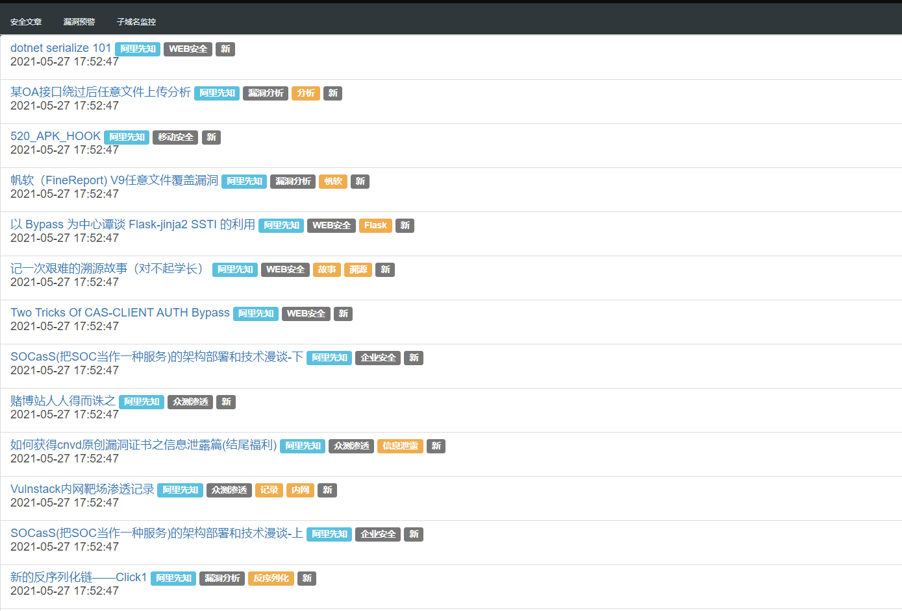

<!--
 * @Author: Recar
 * @Date: 2021-01-09 21:33:54
 * @LastEditors: Recar
 * @LastEditTime: 2021-01-16 10:39:34
-->
# 获取安全文章/CVE的脚本

## 啥样的


## 使用

```shell
git clone git@github.com:Ciyfly/sec_news.git
cd sec_news
chmod +x build.sh
./build.sh
sudo docker run --name sec_new -v /etc/localtime:/etc/localtime  -p 8087:5050 -d sec_new:0.1
```

## 目前都有哪些

1. 安全文章:
    - 阿里云
    - 安全客
    - freebuf
    - paper

2. cve:
    - github
    - cve

## 子域名监控
还在开发中
